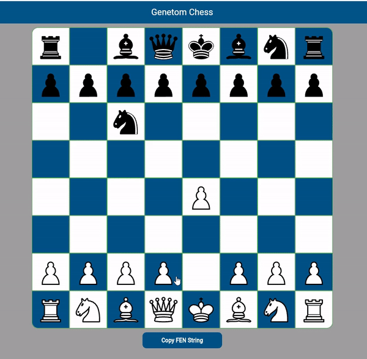

# Genetom Chess Engine - Flutter 🚀

Welcome to the Genetom Chess Engine project! This engine supports both player vs player and player vs computer modes, providing a seamless chess playing experience.


## Demo 🎥
Check out the demo of the Genetom Chess Engine in action: [Demo Link](https://thirudev50.github.io/genetom-chess-engine-flutter/#/){:target="_blank"}



## Features 🌟
- Play chess against another player or challenge the computer.
- The computer evaluates all possible moves to provide a challenging opponent.
- Clean and intuitive user interface built with Flutter.

## Usage 🎮
``` dart
//Configuration for the Engine
ChessConfig config = ChessConfig(
        fenString: fenInput,
        isPlayerAWhite: isPlayerWhite,
        difficulty: Difficulty.medium);

//Initializing the Engine
ChessEngine chessEngine = ChessEngine(
      config,
      pawnPromotion: (isWhitePawn, targetPosition) {
        // This will trigger whenever a pawn promotion happens.
        piece = ChessPiece.queen;
        chessEngine.setPawnPromotion(targetPosition, piece);
      },
      boardChangeCallback: (newData) {
        // This will call whenever the boar data updates.
      },
      gameOverCallback: (gameStatus) {
        // This will trigger whenever the game ends (WhiteWins or BlackWins or Draw).
      },
    );
    
```

## Exposed Methods and Uses 📚
Here's a list of exposed methods/callbacks along with their uses:

| Method/Callback | Description |
| --- | --- |
| `boardChangeCallback(newBoardData)` | This call back will trigger whenever there is a change in the board |
| `gameOverCallback(gameOverStatus)` | This call back will trigger whenever the game over, and it contains the data about the game over (WhiteWins, BlackWins, Draw) |
|`pawnPromotion(isWhitePiece,pawnPosition)` | This will trigger when a pawn promotion happens. |
|`getHalfMoveClock()`      | Return the Half move Clock - Typically return int.   |
|`getFullMoveNumber()`       | Return Full move number for the game.   |
|`getBoardData()`      |  This will return the current board data which is of type List<List<int>>.  |
|`getMovesLogsData()`      | This will return the move logs, So we can implement Undo move.    |
|`generateBestMove()`      |  This will calculate the possible move of all the elements in the board, and based on difficulty it will return the best possible move.  |
|`generateRandomMove()`| This will generate a random legal move.   |
|`getValidMovesOfPeiceByPosition(board,pos)`      |  By taking the board and position of a piece by input, It will return all the possible legal moves.  |
|`setPawnPromotion(pos,piece)`       |   Can use this to set pawn promotion. |
|`movePiece(move)`      | By having the move, This will perform the movement of piece in the board.   |
|`getFenString(isWhiteTurn)`       | This will get the current board posoition in the format of FEN string.   |
|`setFenString(fenStr)`      |  This will take the FEN string as Input and Initialize the board according to that.  |
|`isValidFEN(fenStr)`    |  Take a string as input and return true if it is a valid FEN.  |
# Contact Me 📬

Feel free to reach out to me for any inquiries or collaborations:

🌐 [My Portfolio](https://thirudev50.github.io/portfolio/){:target="_blank"}

🔗 [My LinkedIn](https://www.linkedin.com/in/thirumoorthy-n/){:target="_blank"}

📧 Email: thiru.dev50@gmail.com{:target="_blank"}

## Get Started 🚀
1. Clone this repository.
2. Open the project in your preferred Flutter development environment.
3. Run the project on your emulator or physical device or in browser.
4. Start playing chess!

## Contribution 🤝
Contributions are welcome! Feel free to submit issues, feature requests, or pull requests to help improve this project.

## License 📄
This project is licensed under the MIT License - see the [LICENSE](LICENSE) file for details.
